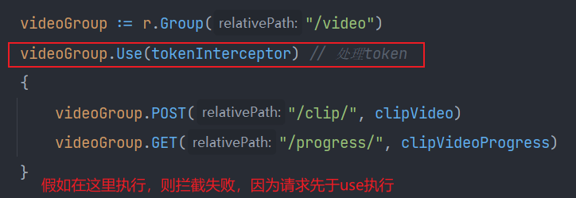
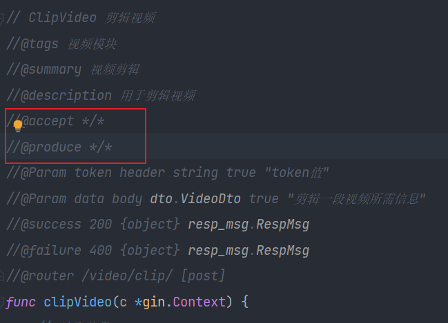

# 项目的数据库表

```sql
/*
MySQL - 5.7.37 : Database - video_clip_system
*/
CREATE DATABASE IF NOT EXISTS `video_clip_system`

USE `video_clip_system`;

/*Table structure for table `clipped_video` */
CREATE TABLE `clipped_video` (
  `id` bigint(20) NOT NULL AUTO_INCREMENT,
  `user_id` bigint(20) NOT NULL,
  `in_url` varchar(500) NOT NULL,
  `out_url` varchar(500) DEFAULT NULL,
  `start_timestamp` bigint(20) NOT NULL,
  `end_timestamp` bigint(20) NOT NULL,
  `file_in` varchar(100) DEFAULT NULL,
  `file_out` varchar(100) DEFAULT NULL,
  PRIMARY KEY (`id`)
) ENGINE=InnoDB AUTO_INCREMENT=10 DEFAULT CHARSET=utf8mb4;

/*Table structure for table `user` */
CREATE TABLE `user` (
  `id` bigint(20) NOT NULL AUTO_INCREMENT,
  `email` varchar(300) NOT NULL,
  `password` varchar(300) NOT NULL,
  PRIMARY KEY (`id`),
  UNIQUE KEY `index_email` (`email`)
) ENGINE=InnoDB AUTO_INCREMENT=8 DEFAULT CHARSET=utf8mb4;
```


# bug出现与解决

- ffmpeg安装成功并配置环境变量，代码运行 `cmd.Run()` 找不到 `ffmpeg`
  - 解决方法：重启编辑器
- ffmpeg在剪辑视频时最后的输出文件需要指定后缀，不然报错
- ffmpeg报错: `Permission denied`, 原因: 输入的文件所在文件夹权限不够, 
  - 加到最高权限 `0777`
- jwt生成token失败, 报错信息: `key is invalid or of invalid type`
  - 解决办法: `GoJwtSecret`在任何地方，转成 []byte 在传进去
- gorm报错：model accessible fields required
  - 承载数据的结构体首字母没大写
- swagger发请求报错，但有apifox却不会
  - 注意看一下有没有把跨域配置了
- 给HTTP响应报文写入状态码范围0-999，超了报错
- gorm没有隐式指明表就需要自己指明
- 在使用Gin的中间件功能用于拦截token来解析时，一定要注意执行Use的顺序
  - 

- 使用swagger时，`@produce: */*`、`@accept: */*` 是最好的选择，不然会莫名奇妙的出现意想不到的错误
  - 